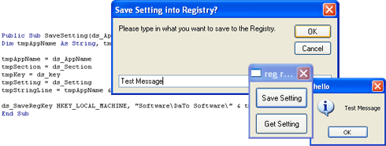



## Registry Replacement

### Description

This code Replaces the Visual Basic SaveSetting, and GetSetting with these new ones... they have the ability to save to ANY reg location like 'HKEY_LOCAL_MACHINE' or 'HKEY_CURRENT_USER' to any path + the path mentioned in the SaveSetting.

You will understand when you download what this is about... this code makes your applications much much more professional.

you can use this code anywhere i dont care... just plz vote 4 me heaps... beacuse it took looooooooots of mucking arround.
 
### More Info
 

             |
---                |---
**Submitted On**   |2005-07-18 01:00:02
**By**             |[Dave Nedved](https://github.com/Planet-Source-Code/PSCIndex/blob/master/ByAuthor/dave-nedved.md)
**Level**          |Intermediate
**User Rating**    |4.3 (13 globes from 3 users)
**Compatibility**  |VB 5\.0, VB 6\.0
**Category**       |[Registry](https://github.com/Planet-Source-Code/PSCIndex/blob/master/ByCategory/registry__1-36.md)
**World**          |[Visual Basic](https://github.com/Planet-Source-Code/PSCIndex/blob/master/ByWorld/visual-basic.md)
**Archive File**   |[Registry\_R1914517182005\.zip](https://github.com/Planet-Source-Code/dave-nedved-registry-replacement__1-61749/archive/master.zip)

